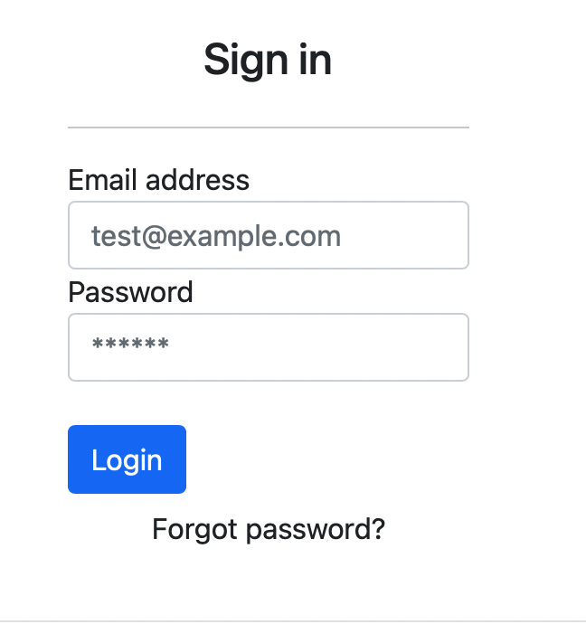
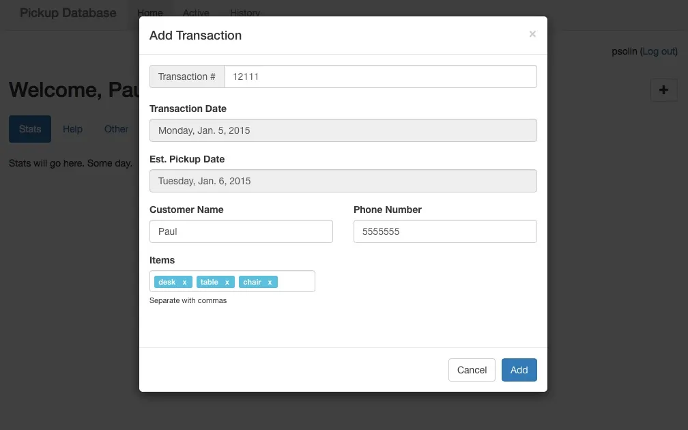

# Django Inventory Pickup Web App
Created to help keep track of sold/held customer merchandise.

## General concepts
Customers make a sale, which are referred to as transactions.  Transactions have items.  These items are held by a store, and need to be tracked.

## How to use
Install Django 2.0+.

Download and `cd` into the repository.

Run migrations: `python manage.py makemigrations`, then `python manage.py migrate`.

Create a superuser: `python manage.py createsuperuser --username=YOUR_USERNAME --email=YOUR_EMAIL_ADDRESS`

In settings.py, change the time zone (if necessary) and secret key.

`python manage.py runserver` to start the development server.

Create/manage users through the admin.

## Screenshots

## About
Additional features and minor bug fixes are on my mind.  Please feel free to fork or file a bug report.  Visit http://paulsolin.com for more information.

## Projects/technologies utilized
Django -- https://www.djangoproject.com

Bootstrap -- http://getbootstrap.com

SQLite -- https://sqlite.org

jQuery -- http://jquery.com

pickadate.js -- http://amsul.ca/pickadate.js/

Bootstrap Tagsinput -- https://timschlechter.github.io/bootstrap-tagsinput/examples/

Bootstrap Confirmation -- https://github.com/Tavicu/bootstrap-confirmation

(slightly modified) Bootgrid -- http://jquery-bootgrid.com
